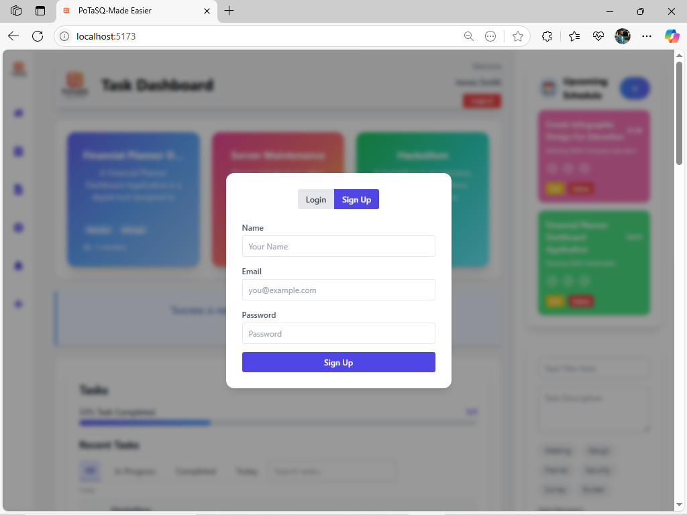

> **Note:** This app is still under construction. Some features and sections are yet to be completed.

# 📝 PoTaSQ (Posts, Tasks, Schedules, and Quotes)

*This app was created as part of the Week 3 React.js, JSX, and Tailwind CSS assignment.*

A Personal Organizer App built with React.js, Tailwind CSS, and Vite

 
[Dashboard](Screenshot/Screenshot71.png) 
[The Rest of the page](Screenshot/Screenshot72.png) 

---

## 🚀 Features
- **Task Management** – Add, complete, delete, and filter tasks.
- **Post Display** – Fetch and display posts from an API (JSONPlaceholder).
- **Schedule Planner** – Manage daily schedules (future implementation).
- **Quote Generator** – Fetch and display inspirational quotes.
- **Dark/Light Mode** – Toggle between themes using Tailwind CSS.
- **Responsive Design** – Works on mobile, tablet, and desktop.

---

## 🛠️ Technologies Used
- **Frontend:** React.js (Vite)
- **Styling:** Tailwind CSS
- **State Management:** React Hooks (`useState`, `useEffect`, `useContext`)
- **Routing:** React Router
- **API Integration:** JSONPlaceholder (for posts)
- **Custom Hooks:** `useLocalStorage` (for task persistence)

---

## ⚙️ Installation & Setup

### Prerequisites
- Node.js (v18 or higher recommended)

### Steps to Run Locally

1. **Clone the repository**
   ```sh
   git clone https://github.com/PLP-MERN-Stack-Development/week-3-react-js-assignment-smunyondi.git
   ```
2. **Navigate to the project directory**
   ```sh
   cd week-3-react-js-assignment-smunyondi
   ```
3. **Install dependencies**
   ```sh
   pnpm install
   ```
4. **Run the development server**
   ```sh
   pnpm run dev
   ```
5. **Open in browser**
   Visit [http://localhost:5173](http://localhost:5173) to view the app.

---

## 📂 Project Structure

```
src/
├── assets/                # Static assets (images, icons, etc.)
├── components/            # Reusable UI components
│   ├── Button.jsx
│   ├── Card.jsx
│   ├── Footer.jsx
│   ├── Navbar.jsx
│   ├── QuoteBox.jsx
│   ├── ScheduleList.jsx
│   ├── TaskInput.jsx
│   ├── TaskItem.jsx
│   ├── TaskList.jsx
│   └── TaskManager.jsx
├── context/               # React context providers (e.g., ThemeContext)
│   └── ThemeContext.jsx
├── hooks/                 # Custom hooks
│   └── useLocalStorage.js
├── pages/                 # App screens
│   ├── Home.jsx
│   ├── Posts.jsx
│   ├── Quotes.jsx
│   └── Schedules.jsx
├── styles/                # Tailwind/CSS files
│   └── index.css
├── App.jsx                # Main app layout
├── main.jsx               # Entry point
└── index.html             # HTML template
```

---

## 🎯 Key Implementation Details

### 1. Task Manager
- Uses `useState` for task state.
- Implements filtering (All/Active/Completed).
- Persists tasks in `localStorage` via `useLocalStorage` hook.

### 2. API Integration (JSONPlaceholder)
- Fetches posts with `fetch` + `useEffect`.
- Handles loading and error states.
- Includes search functionality for posts.

### 3. Theming (Dark/Light Mode)
- Uses `useContext` for theme management.
- Tailwind CSS `dark:` modifier for dynamic styling.

### 4. Responsive UI
- Built with Tailwind CSS (flexbox, grid, media queries).
- Mobile-first design approach.

---

## 📜 License

This project is open-source under the MIT License.

---

**Author:** Simeon Munyondi


